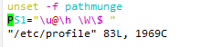

1.自定义shell终端提示符

修改图中的终端提示符样式

```shell
vim sudo /etc/profile
# 添加
PS1="\u@\h \W\$ "
```



```shell
#激活
source /etc/profile
```


> 参考样式：https://www.cnblogs.com/lienhua34/p/5018119.html

2.find命令跳过目录

