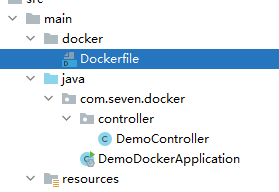
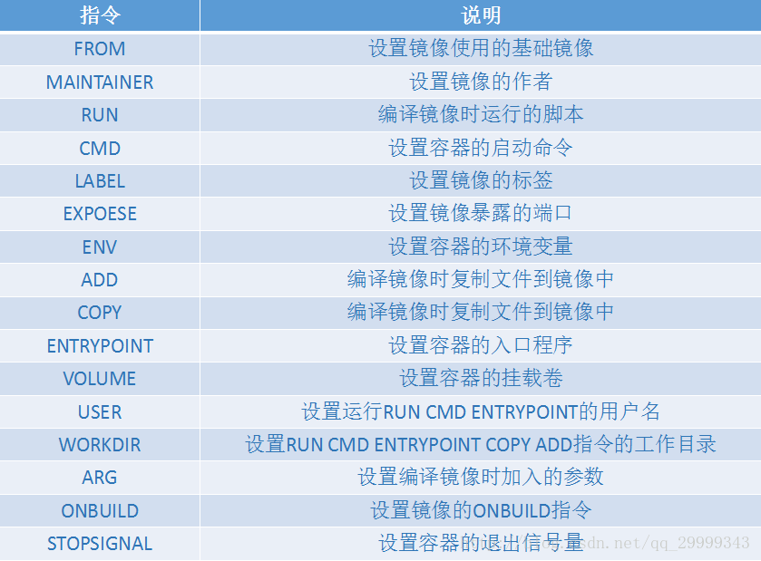
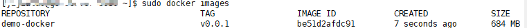
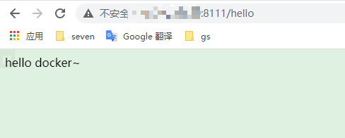
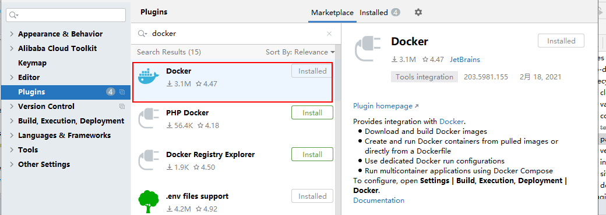
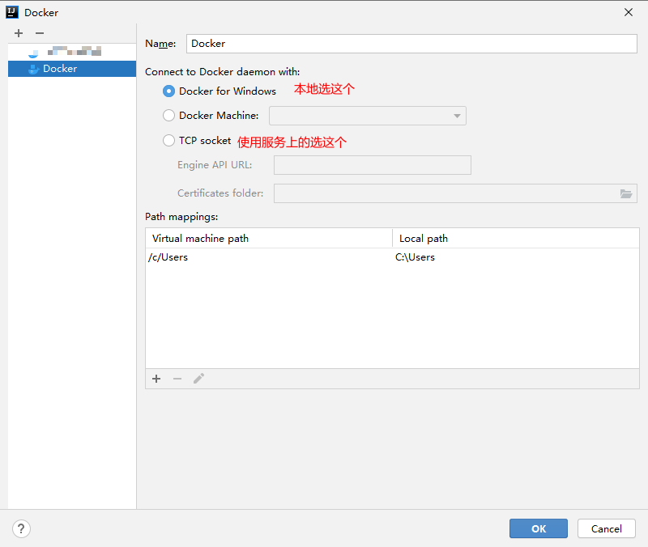
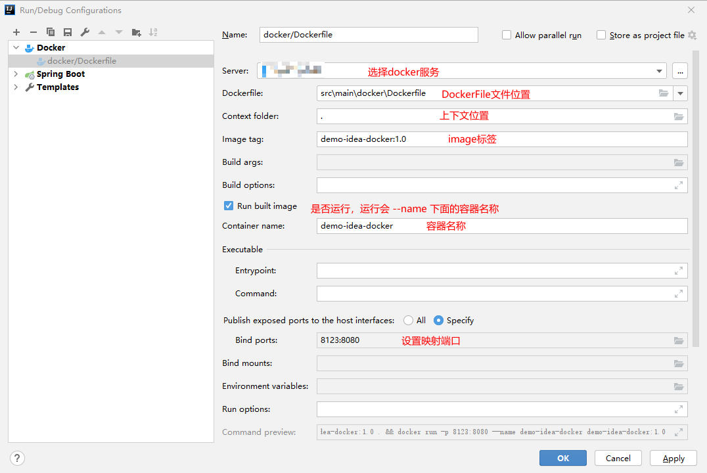
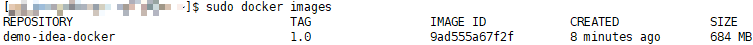
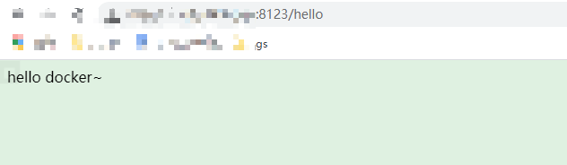

# Docker打包SpringBoot项目

## 1.快速入门

> 参考：https://www.cnblogs.com/zmsn/p/11697575.html

1. 创建springboot项目

2. 创建Dockerfile文件如：

3. 编辑DockerFile

   ```dockerfile
   # FROM 设置基础镜像
   FROM openjdk:11
   # 设置镜像作者
   MAINTAINER seven
   # VOLUME 设置容器的挂载卷
   VOLUME /tmp
   # 编译时复制文件到镜像中
   ADD demo-docker-0.0.1-SNAPSHOT.jar test.jar
   # RUN 编译镜像时运行的脚本
   RUN bash -c 'touch /test.jar'
   # 设置容器的入口
   ENTRYPOINT ["java","-jar","/test.jar"]
   ```

   

4. 上传jar和DockerFile到服务器

5. 制作docker镜像：

   ```shell
    sudo docker build -t demo-docker:v0.0.1 .
   ```

6. 查看生成镜像：docker images

7. 运行镜像：

   ```shell
   sudo docker run -d -p 8111:8080 --name test-docker demo-docker:v0.0.1
   ```

   

## 2.Idea快速打包docker

1. 下载idea插件

2. 修改docker远程配置（如果本地有win本地有docker可以用本地）

   **注意：**此处需要docker开启TCP

   - sudo vim /etc/docker/daemon.json 

   - 加入："hosts": ["tcp://0.0.0.0:2376","unix:///var/run/docker.sock"]

     ```json
     {
     "registry-mirrors": [
         "https://registry.docker-cn.com",
         "http://hub-mirror.c.163.com",
         "https://docker.mirrors.ustc.edu.cn"
     ],
     "hosts": ["tcp://0.0.0.0:2376","unix:///var/run/docker.sock"],
     "graph": "/data1/docker"
     }
     ```

   - 重启

     ```shell
     sudo systemctl daemon-reload 
     sudo systemctl restart docker
     ```

   > 参考：https://www.imooc.com/article/details/id/28426

3. 编写DockerFile

   ```dockerfile
   # FROM 设置基础镜像
   FROM openjdk:11
   # 设置镜像作者
   MAINTAINER seven
   # VOLUME 设置容器的挂载卷
   VOLUME /tmp
   # 编译时复制文件到镜像中，注意此处是当前开发路径‘target/demo-docker-0.0.1-SNAPSHOT.jar’
   COPY target/demo-docker-0.0.1-SNAPSHOT.jar test.jar
   # RUN 编译镜像时运行的脚本
   RUN bash -c 'touch /test.jar'
   # 设置容器的入口
   ENTRYPOINT ["java","-jar","/test.jar"]
   ```

4. idea 配置docker启动

   

5. 查看结果

   

