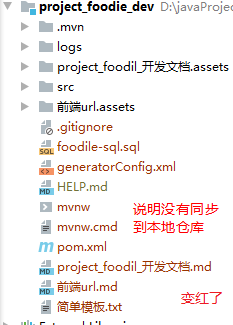

## 1、概述

官网：https://git-scm.com/

Git是一个[免费的开源](https://git-scm.com/about/free-and-open-source) 分布式版本控制系统，旨在快速高效地处理从小型到大型项目的所有内容。

Git是一个免费的开源版本控制系统，旨在快速高效地处理从小型项目到大型项目的所有内容。

Git [易于学习](https://git-scm.com/doc)， [占地面积小，具有闪电般的快速性能](https://git-scm.com/about/small-and-fast)。它具有Subversion，CVS，Perforce和ClearCase之类的SCM工具，具有[廉价的本地分支](https://git-scm.com/about/branching-and-merging)，方便的[暂存区域](https://git-scm.com/about/staging-area)和 [多个工作流等功能](https://git-scm.com/about/distributed)。

GIT简单易学，占地小，并且具有闪电般的性能。它具有SCM工具，例如Subversion，CVS，Perforce和ClearCase，廉价的本地分支，方便的暂存区以及多个工作流程。


## 2、下载并安装

[下载地址](https://git-scm.com/downloads)

运行.exe后可以一顿next


简单设置

```cmd
git config --global user.name "seven"
git config --global user.email "sevenyjl@gmail.com"
```


## 3、创建版本库

> 什么是版本库呢？版本库又名仓库，英文名**repository**，你可以简单理解成一个目录，这个目录里面的所有文件都可以被Git管理起来，每个文件的修改、删除，Git都能跟踪，以便任何时刻都可以追踪历史，或者在将来某个时刻可以“还原”。

### 1、创建目录

```
cd /d/tool/Git
mkdir repository 
```

### 2、初始化

```
git init
```


### 3、使文件受版本控制

```
vim readme.txt
```

```
Git is a version control system.
Git is free software.
```

wq:保存


告诉git，将文件添加到仓库

```cmd
git add readme.txt
git status
```


提交版本

```
git commit -m "备注"
```


###  小结

现在总结一下今天学的两点内容：

初始化一个Git仓库，使用`git init`命令。

添加文件到Git仓库，分两步：

1. 使用命令`git add `，注意，可反复多次使用，添加多个文件；
2. 使用命令`git commit -m `，完成。

## 4、版本修改

修改刚刚的文件

```txt
Git is a version control system.
Git is free software.
你好！Git！
我的天哪~~~~
```

现在，运行`git status`命令看看结果：


查看我的文件被修改了什么

```
git diff readme.txt
```


### 小结

- 要随时掌握工作区的状态，使用`git status`命令。
- 如果`git status`告诉你有文件被修改过，用`git diff`可以查看修改内容。

## 5、版本回退

查看git修改日志

```
git log
# 或者
git log --pretty=oneline
```


版本回退

首先，Git必须知道当前版本是哪个版本，在Git中，用`HEAD`表示当前版本，也就是最新的提交`324165...`（注意我的提交ID和你的肯定不一样），上一个版本就是`HEAD^`，上上一个版本就是`HEAD^^`，当然往上100个版本写100个`^`比较容易数不过来，所以写成`HEAD~100`。

```
git reset --hard HEAD^
```


回退到第二个版本

```
git reset --hard 324165
```

版本号没必要写全，前几位就可以了，Git会自动去找。当然也不能只写前一两位，因为Git可能会找到多个版本号，就无法确定是哪一个了。

果然，我胡汉三又回来了。


Git的版本回退速度非常快，因为Git在内部有个指向当前版本的`HEAD`指针，当你回退版本的时候，Git仅仅是把HEAD从指向`append GPL`：

```ascii
┌────┐
│HEAD│
└────┘
   │
   └──> ○ append GPL
        │
        ○ add distributed
        │
        ○ wrote a readme file
```

改为指向`add distributed`：

```ascii
┌────┐
│HEAD│
└────┘
   │
   │    ○ append GPL
   │    │
   └──> ○ add distributed
        │
        ○ wrote a readme file
```

查看命令日志

```
git reflog
```


### 小结

现在总结一下：

- `HEAD`指向的版本就是当前版本，因此，Git允许我们在版本的历史之间穿梭，使用命令`git reset --hard commit_id`。
- 穿梭前，用`git log`可以查看提交历史，以便确定要回退到哪个版本。
- 要重返未来，用`git reflog`查看命令历史，以便确定要回到未来的哪个版本。
- [原理](https://www.liaoxuefeng.com/wiki/896043488029600/897271968352576)

## 6、远程仓库

### 1、创建SSH KEY

```
ssh-keygen -t rsa -C "sevenyjl@gmail.com"
```

一顿回车


打开默认保存目录


### 2、配置github

打开**id_rsa.pub** 文件


复制这段一会要用

登录到gitHub


提交成功


在github中创建仓库

### 3、上传到github

现在，我们根据GitHub的提示，在本地的仓库下运行命令：

```
git remote add repostory git@github.com:sevenyjl/myGit.git
# 将master分支推送到github上
git push -u repostory master
```


#### SSH警告

当你第一次使用Git的`clone`或者`push`命令连接GitHub时，会得到一个警告：

```
The authenticity of host 'github.com (xx.xx.xx.xx)' can't be established.
RSA key fingerprint is xx.xx.xx.xx.xx.
Are you sure you want to continue connecting (yes/no)?
```

这是因为Git使用SSH连接，而SSH连接在第一次验证GitHub服务器的Key时，需要你确认GitHub的Key的指纹信息是否真的来自GitHub的服务器，输入`yes`回车即可。

Git会输出一个警告，告诉你已经把GitHub的Key添加到本机的一个信任列表里了：

```
Warning: Permanently added 'github.com' (RSA) to the list of known hosts.
```

这个警告只会出现一次，后面的操作就不会有任何警告了。

如果你实在担心有人冒充GitHub服务器，输入`yes`前可以对照[GitHub的RSA Key的指纹信息](https://help.github.com/articles/what-are-github-s-ssh-key-fingerprints/)是否与SSH连接给出的一致。

### 4、小结

要关联一个远程库，使用命令`git remote add origin git@server-name:path/repo-name.git`；

关联后，使用命令`git push -u origin master`第一次推送master分支的所有内容；

此后，每次本地提交后，只要有必要，就可以使用命令`git push origin master`推送最新修改；

分布式版本系统的最大好处之一是在本地工作完全不需要考虑远程库的存在，也就是有没有联网都可以正常工作，而SVN在没有联网的时候是拒绝干活的！当有网络的时候，再把本地提交推送一下就完成了同步，真是太方便了！

## 7、使用IDEA集成的Git

完成**6、远程仓库**配置

### 1、检查环境


### 2、登录github账号


### 3、创建本地仓库




### 4、上传项目到本地仓库


### 5、提交到本地仓库


变为白色说明，同步到本地仓库成功了

### 6、上传到github上


去github查看


## 8、同步到码云

[码云地址](https://gitee.com/)

1、将公钥添加到码云上


2、创建仓库


3、将git的本地仓库同步到码云上

```
git remote add origin git@gitee.com:GTeam_seven/gitee.git
# 将master分支推送到码云上
git push -u origin master
```

如果origin已经使用了，可以使用git remote remove origin 来删除

```
# 删除remote
git remote remove origin
# 查看remote
git remote
# 查看命令帮助
git remote --help
```


查看

## 9、idea同步代码到码云

下载Gitee插件

[Gitee插件2020版 提取码：7777 ](https://pan.baidu.com/s/1ihQy8v9NgdpBmCqpvPKA-A )


## 10、从码云中同步代码到IDEA


GitHub一样

## 11、同步代码到自己服务器


# end