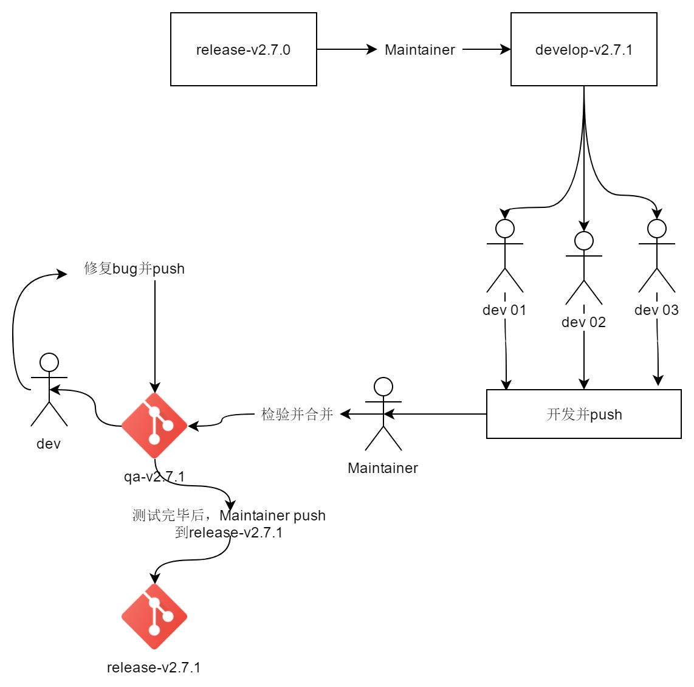
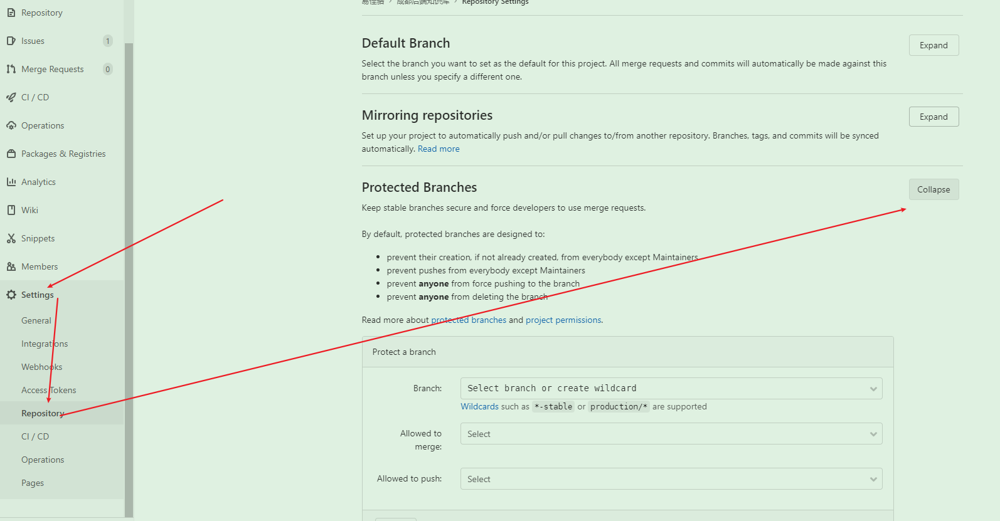
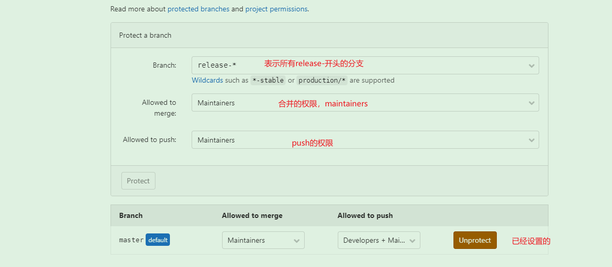
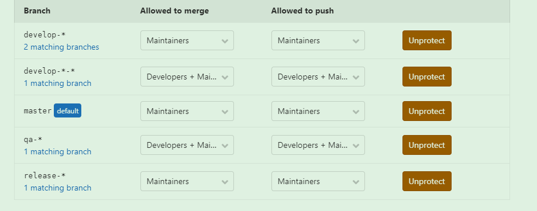

# 分支权限控制

> 需求：管理员才能进行分支合并，开发人员只能new分支进行开发并push。无法push到主的master、release分支上

## 1.分支规范

- master：用于发布重大版本更新（最新稳定版）
- develop：日常开发在此分支上进行
- qa：测试分支
- release：最新版本分支（必须是经过测试的稳定版本）
- 临时分支：
  - **功能（feature）分支：**它是为了开发某种特定功能，从Develop分支上面分出来的。开发完成后，要再并入Develop。可以采用feature-*的形式命名。*
  - **修补bug（hotfix）分支：**软件**正式发布**以后，难免会出现bug。这时就需要创建一个分支，进行bug修补。修补bug分支是从Master分支上面分出来的。修补结束以后，再合并进Master和Develop分支。它的命名，可以采用hotfix-***的形式。

> **注意事项：** 一个分支尽量开发一个功能模块，不要多个功能模块在一个分支上开发。 feature 分支在申请合并之前，最好是先 pull 一下 develop 主分支下来，看一下有没有冲突，如果有就先解决冲突后再申请合并。

命名例子：[]表示可选

release-v1.0.1	-->release-版本

develop-v1.0.1	-->主develop-版本-[功能]

feature-v1.0.1-网关拦截	-->feature-版本-功能说明

hotfix-v1.0.1-图谱查询慢	-->hotfix-版本-bug说明

qa-v1.0.1	-->qa-版本

定制分支：为不同销售对象定制化开发（==必须在项目中创建readme.md并说明定制内容==）

勘探/release-v1.0.1

勘探/develop-v1.0.1

## 2.开发流程



开发者需要从develop-v2.7.1中new新的分支：develop-v2.7.1-开发人名/功能

**每次开发请务必写好reade.md文件**模板见：

```md
# 版本信息

> 开发时间：xxx年xx月xx日
> 
> 开发人员：xxx
> 
> 开发环境：ip/port 部署位置
> 
> 测试环境：ip/port 部署位置

## 功能描述：

## 待优化：

## 相关资料：

设计稿啥的

```

## 3.权限设置

1. 由Maintainer身份进入git

   

2. 设置权限

   

3. 权限设置规范

   | 分支名       | 人员        | 权限        |
   | ------------ | ----------- | ----------- |
   | release-*    | Maintainers | push、merge |
   | develop-\*-* | M+D         | push、merge |
   | develop-*    | M           | push、merge |
   | qa-*         | M+D         | push、merge |
   | master       | M           | push、merge |

   

   > 参考文档：https://gitlab.gridsum.com/help/user/project/protected_branches