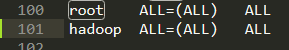
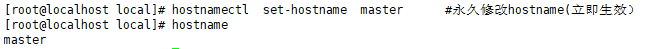
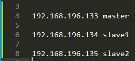

# hodoop集群搭建

```
groupadd hadoop
useradd -m hadoop -g hadoop -s /bin/bash
passwd hadoop
# 密码设置123
vim /etc/sudoers
```



```
# 在 /usr/local/ 目录下创建目录：java、hadoop、hive三个目录并分配权限给hadoop用户
mkdir /usr/local/java
mkdir /usr/local/hadoop
mkdir /usr/local/hive
chown -R hadoop:hadoop /usr/local/hadoop
chown -R hadoop:hadoop /usr/local/java
chown -R hadoop:hadoop /usr/local/hive
```

修改主机名为master【原来为localhost】

```
hostname                               #查看当前的 hostnmae
hostnamectl  set-hostname  master      #永久修改hostname(立即生效）
```



修改host

```
vi /etc/hosts
```



关闭SELinux

```
getenforce         # 查看当前的 SELinux 状态Enforcing
# Disabled表示已经关闭
setenforce 0          # 将 SELinux 的状态临时设置为 Permissive 模式（立即生效）
vi  /etc/selinux/config   
```


修改为这样后重启生效

关闭防火墙

```
 systemctl disable firewalld            # 永久关闭防火墙（重启生效）
 systemctl stop firewalld               # 临时关闭防火墙（立即生效）
```

