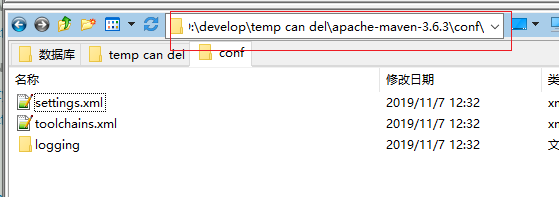
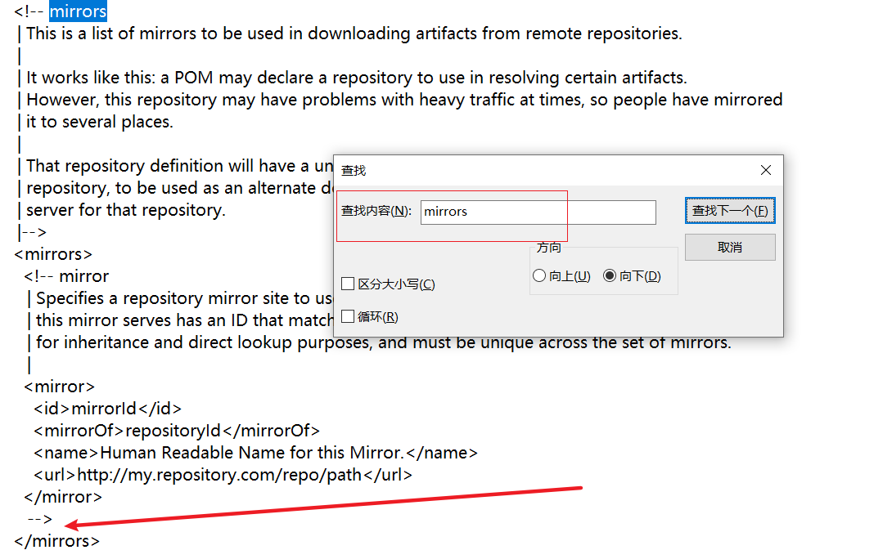
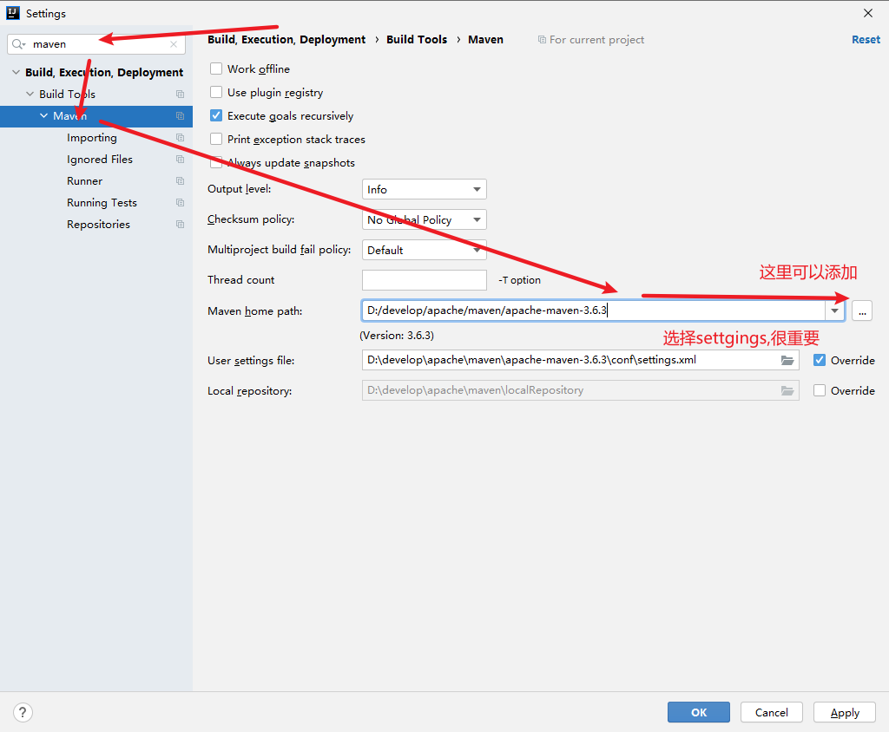

# win开发环境构建

官网：https://maven.apache.org/

1.下载

下载地址：https://mirrors.bfsu.edu.cn/apache/maven/maven-3/3.6.3/binaries/apache-maven-3.6.3-bin.zip

2.解压

解压到指定目录

3.修改镜像

打开./conf/settings.xml

```xml
<!-- 阿里云中央仓库 -->
    <mirror>
        <id>nexus-aliyun</id>
        <mirrorOf>central</mirrorOf>
        <name>Nexus aliyun</name>
        <url>http://maven.aliyun.com/nexus/content/groups/public</url>
    </mirror>
```





**或者**使用提供的：https://gitee.com/GTeam_seven/study/blob/master/java/maven/settings-ali.xml 覆盖掉settings.xml

4.idea中配置

> [可选]idea破解教程见：https://gitee.com/GTeam_seven/study/blob/master/idea/idea%E6%BF%80%E6%B4%BB%E6%95%99%E7%A8%8B.md

快捷键：ctrl+alt+s



> 视频见：https://haokan.baidu.com/v?vid=4034146993862987470

# Linux环境构建

