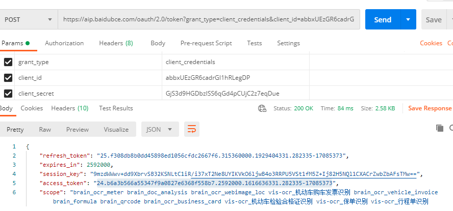
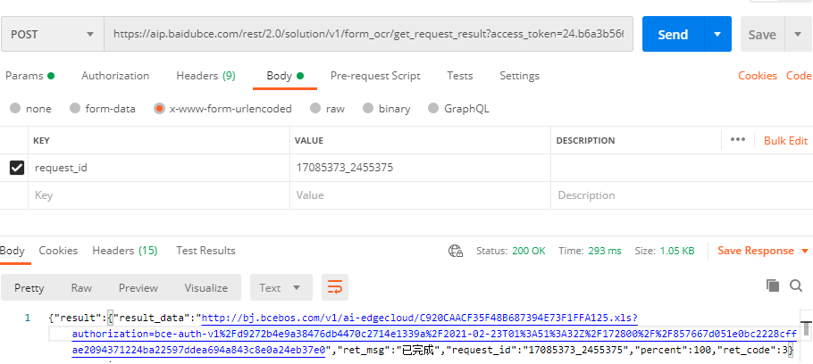

# 百度文字识别

[app key](https://console.bce.baidu.com/ai/?fromai=1#/ai/ocr/app/list)

1. [获取access_token](https://ai.baidu.com/ai-doc/REFERENCE/Ck3dwjhhu)

   

2. [百度ORC识别文档](https://ai.baidu.com/ai-doc/OCR/Ik3h7y238)

   java运行

   ```java
   
   /**
    * 表格文字识别(异步接口)
    */
   public class FormOcrRequest {
   
       /**
        * 重要提示代码中所需工具类
        * FileUtil,Base64Util,HttpUtil,GsonUtils请从
        * https://ai.baidu.com/file/658A35ABAB2D404FBF903F64D47C1F72
        * https://ai.baidu.com/file/C8D81F3301E24D2892968F09AE1AD6E2
        * https://ai.baidu.com/file/544D677F5D4E4F17B4122FBD60DB82B3
        * https://ai.baidu.com/file/470B3ACCA3FE43788B5A963BF0B625F3
        * 下载
        */
       public static String formOcrRequest() {
           // 请求url
           String url = "https://aip.baidubce.com/rest/2.0/solution/v1/form_ocr/request";
           try {
               // 本地文件路径
               String filePath = "C:\\Users\\T470\\Desktop\\微信图片_20210223091734.jpg";
               byte[] imgData = FileUtil.readFileByBytes(filePath);
               String imgStr = Base64Util.encode(imgData);
               String imgParam = URLEncoder.encode(imgStr, "UTF-8");
   
               String param = "image=" + imgParam;
   
               // 注意这里仅为了简化编码每一次请求都去获取access_token，线上环境access_token有过期时间， 客户端可自行缓存，过期后重新获取。
               String accessToken = "24.b6a3b566a55347f9a0827e6368f558b7.2592000.1616636331.282335-17085373";
   
               String result = HttpUtil.post(url, accessToken, param);
               System.out.println(result);
               return result;
           } catch (Exception e) {
               e.printStackTrace();
           }
           return null;
       }
   
       public static void main(String[] args) {
           //{"result":[{"request_id":"17085373_2455375"}],"log_id":1614045082373329}
           //{"result":[{"request_id":"17085373_2455375"}],"log_id":1614045082373329}
           System.out.println(FormOcrRequest.formOcrRequest());
       }
   }
   ```

3. 获取识别结果

   

4. 

