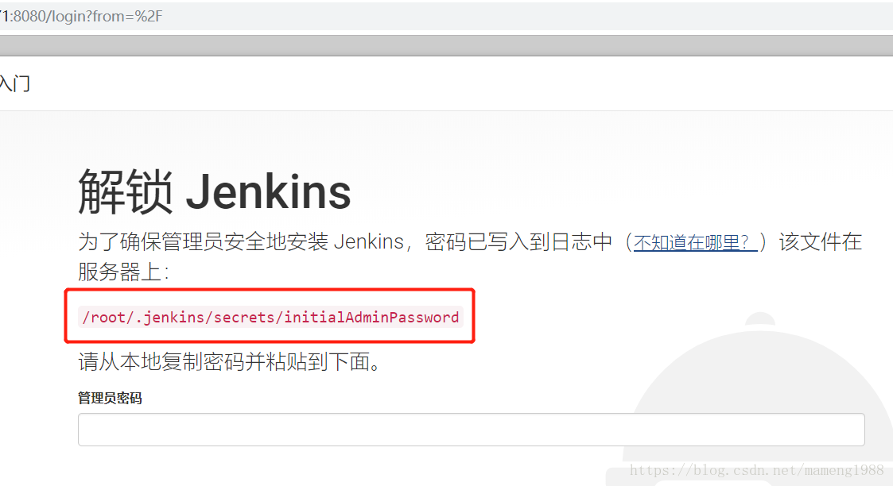

# Jenkins的入门搭建

##  centos搭建

### 单机

1.下载

https://www.jenkins.io/download/

参考：https://pkg.jenkins.io/redhat-stable/

2.第一次启动

```shell
java -jar jenkins.war --httpPort=你的端口(8080)
```

3.浏览器访问

localhost:你的端口

输入管理员密码

4.插件安装

点击选择插件安装(后面配置镜像后安装插件)

5.插件安装

见：插件安装&推荐说明文档

## win搭建

## docker安装