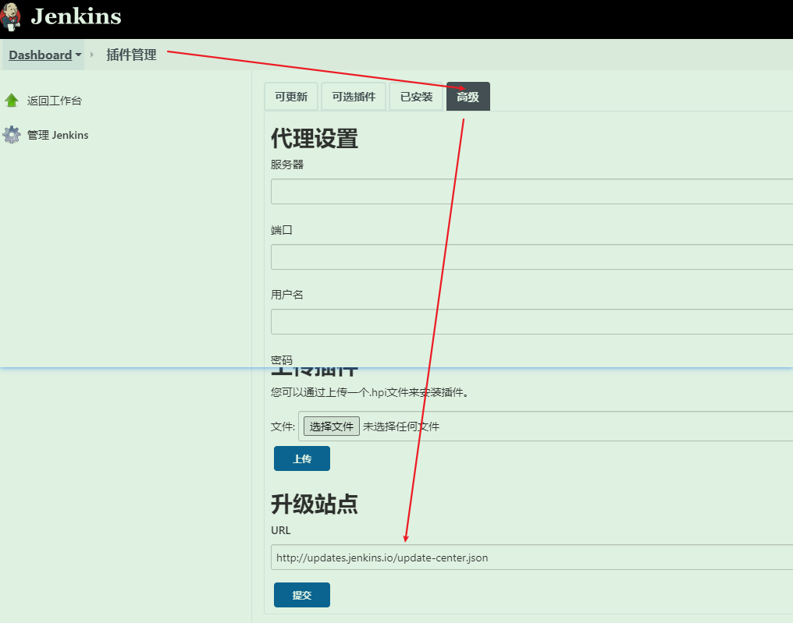

# 插件安装以及推荐

## 插件安装

### 离线安装

1. 离线安装地址：http://updates.jenkins-ci.org/download/plugins/
2. 上传安装

### 在线安装

1. 配置镜像：

> 镜像地址：
>
> http://updates.jenkins.io/update-center.json
>
> 

## 插件推荐

### [Git Parameter Plug-In](https://plugins.jenkins.io/git-parameter)

用于git的参数选则，可以选择branch，自定义params等

依赖：This plugin used directly the[ Git Plugin](https://wiki.jenkins.io/display/JENKINS/Git+Plugin) and [Git Client Plugin](https://wiki.jenkins.io/display/JENKINS/Git+Client+Plugin).

