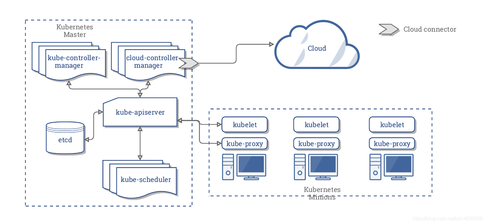

# 环境搭建

## centos

### 单机模式



环境概述

k8s-master、k8s-node01、k8s-node02、harbor

|               |      |        |
| ------------- | ---- | ------ |
| 10.202.83.203 |      |        |
| 10.202.41.81  |      |        |
| 10.202.41.77  |      |        |
| 10.202.41.81  | 7001 | harbor |

source切换

添加相应的源 由于需要下载Kubeadm，Kubelet和Kubernetes-cni，多以需要添加源。国外的直接添加google源，具体可以网上搜索。国内的推荐中科大的源，命令如下：

```shell
cat <<EOF > /etc/apt/sources.list.d/kubernetes.list
deb http://mirrors.ustc.edu.cn/kubernetes/apt kubernetes-xenial main
EOF
```

> apt源：
>
> http://mirrors.ustc.edu.cn/kubernetes/apt
>
> https://mirrors.aliyun.com/kubernetes/apt/

### 机器模式