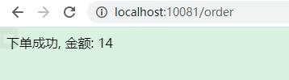
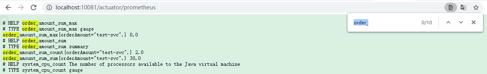
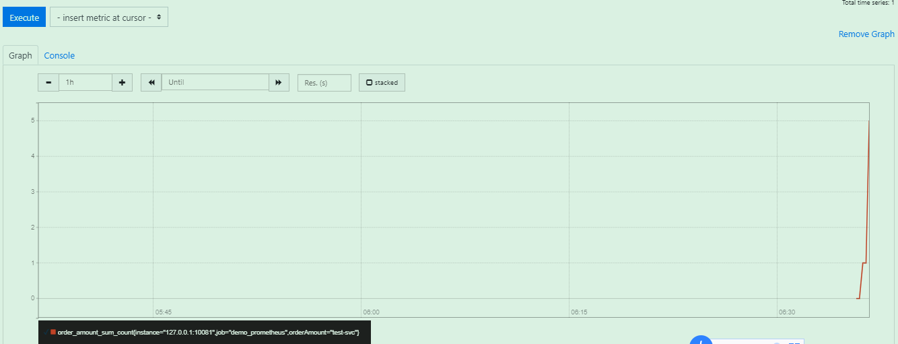

# Springboot自定义监控指标

> 在[上文](https://gitee.com/GTeam_seven/study/blob/master/promethues%E7%9B%91%E6%8E%A7/04%E6%99%8B%E7%BA%A7-%E4%B8%8Espringboot%E7%9A%84%E4%BD%BF%E7%94%A8.md)基础上进行

1.构建prometheus指标

```java

import io.micrometer.core.instrument.Counter;
import io.micrometer.core.instrument.DistributionSummary;
import io.micrometer.core.instrument.MeterRegistry;
import org.springframework.beans.factory.annotation.Autowired;
import org.springframework.stereotype.Component;

import javax.annotation.PostConstruct;

/**
 * 此次模拟监控：订单发起次数、金额统计指标
 */
@Component
public class PrometheusCustomMonitor {
    /**
     * 订单发起次数
     */
    private Counter orderCount;
    /**
     * 金额统计
     */
    private DistributionSummary amountSum;

    private final MeterRegistry registry;

    @Autowired
    public PrometheusCustomMonitor(MeterRegistry registry) {
        this.registry = registry;
    }

    @PostConstruct
    private void init() {
        orderCount = registry.counter("order_request_count", "order", "test-svc");
        amountSum = registry.summary("order_amount_sum", "orderAmount", "test-svc");
    }

    public Counter getOrderCount() {
        return orderCount;
    }

    public DistributionSummary getAmountSum() {
        return amountSum;
    }
}
```

2.Controller进行指标记录

```java

import org.springframework.web.bind.annotation.RequestMapping;
import org.springframework.web.bind.annotation.RestController;

import javax.annotation.Resource;
import java.util.Random;

@RestController
public class TestController {

    @Resource
    private PrometheusCustomMonitor monitor;

    @RequestMapping("/order")
    public String order() throws Exception {
        // 统计下单次数
        monitor.getOrderCount().increment();
        Random random = new Random();
        int amount = random.nextInt(100);
        // 统计金额
        monitor.getAmountSum().record(amount);
        return "下单成功, 金额: " + amount;
    }
}
```

3.请求查看



4.使用promsq进行查看



5.总结

1. 自定义指标需要用到`MeterRegistry`类，注入即可

2. 指标类型：

   ```java
   meterRegistry.counter = registry.counter("counter");
   counter.increment();//负责计数，会自增1
   meterRegistry.summer
   meterRegistry.timmer//Timer(计时器)适用于记录耗时比较短的事件的执行时间，通过时间分布展示事件的序列和发生频率。所有的Timer的实现至少记录了发生的事件的数量和这些事件的总耗时，从而生成一个时间序列。
   meterRegistry.gauge//Gauge(仪表)是获取当前度量记录值的句柄，也就是它表示一个可以任意上下浮动的单数值度量Meter。Gauge通常用于变动的测量值，测量值用ToDoubleFunction参数的返回值设置，如当前的内存使用情况，同时也可以测量上下移动的”计数”，比如队列中的消息数量。
   meterRegistry.summary//总和
   ```

3. 结合AOP更方便实现自定义指标

> 更多参考：https://prometheus.io/docs/introduction/overview/
>
> demo：