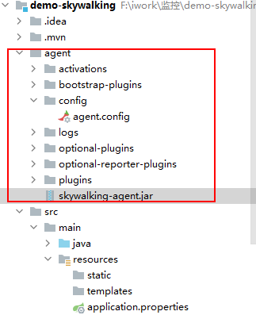
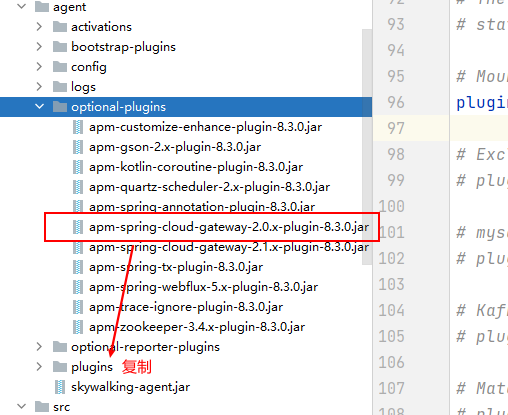
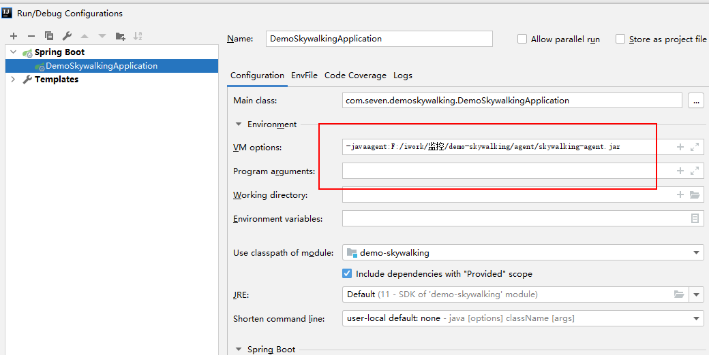

# skywalking win部署&入门demo

> 参考文档：https://github.com/apache/skywalking/blob/5.x/docs/cn/Quick-start-CN.md

1. [下载sky walking](https://archive.apache.org/dist/skywalking/8.3.0/apache-skywalking-apm-8.3.0.tar.gz)

2. 解压

3. 配置es

   ./config/application.yml

   ```yaml
   storage:
     selector: ${SW_STORAGE:h2}
     elasticsearch:
       nameSpace: ${SW_NAMESPACE:""}
       clusterNodes: ${SW_STORAGE_ES_CLUSTER_NODES:ES地址:9200}
   ```

4. 配置前端UI信息

   ./webapp/webapp.yml

   ```yml
   server:
   # 修改前端访问端口即可
     port: 8072
   
   collector:
     path: /graphql
     ribbon:
       ReadTimeout: 10000
       # Point to all backend's restHost:restPort, split by ,
       listOfServers: 127.0.0.1:12800
   ```

5. 启动

   运行./bin/startup.bat

   注意：如何无法启动前端webapp需要手动执行

   ```shell
   cd ./webapp
   java -jar skywalking-webapp.jar --spring.config.location=webapp.yml
   ```

6. 访问http://127.0.0.1:8072/

7. 编写demo

   1. 创建一个springboot项目

   2. 编写测试controller

   3. 将skywalking下的agent整体复制到 项目路径，方便配置修改启动

      注意不要动目录结构

      ==这里有一点，需要注意，skywalking要对spring cloud gateway支持，需要添加个插件==

      

   4. 修改一些配置

      打开agent/config/agent.config

      ```properties
      # The service name in UI
      # 用户界面中的服务名称
      agent.service_name=${SW_AGENT_NAME:Your_ApplicationName}
      
      # Backend service addresses.
      # skywalking服务地址
      collector.backend_service=${SW_AGENT_COLLECTOR_BACKEND_SERVICES:127.0.0.1:11800}
      ```

   5. 启动添加参数

      注意是idea里面agent的路径

   6. 遗留问题：

      - 如何VM options处理 用户界面中的服务名称

   7. 

