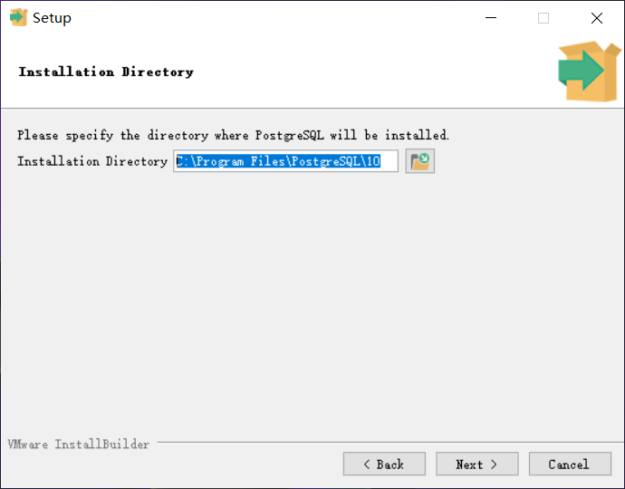
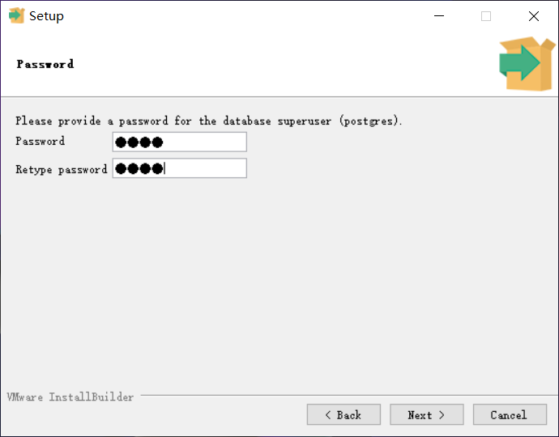
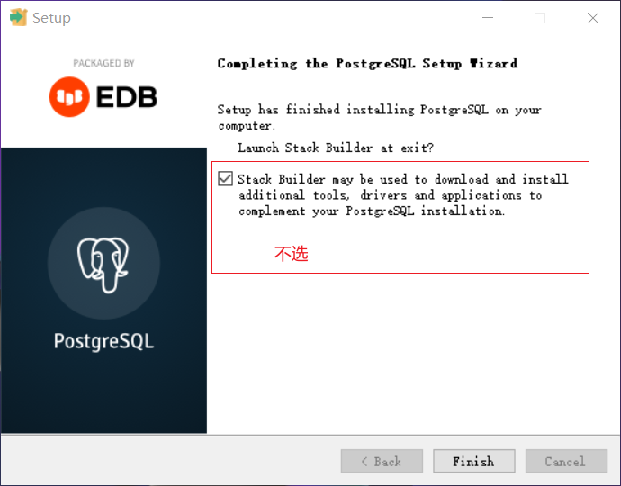
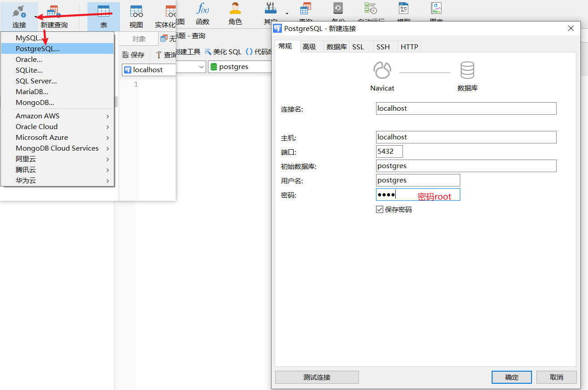

# postgres环境搭建

## win环境搭建

> 搭建方式有exe和zip

下载：https://get.enterprisedb.com/postgresql/postgresql-10.16-1-windows-x64.exe
自用渠道：

1.运行exe

选择安装目录

设置用户名和密码postgres/root，端口默认设置5432

2.打开navicat

navicat破解教程见：

> 参考安装文档：https://www.runoob.com/postgresql/windows-install-postgresql.html
>
> 视频地址：https://haokan.baidu.com/v?vid=3908241243113628075

## linux环境搭建

## docker环境搭建

