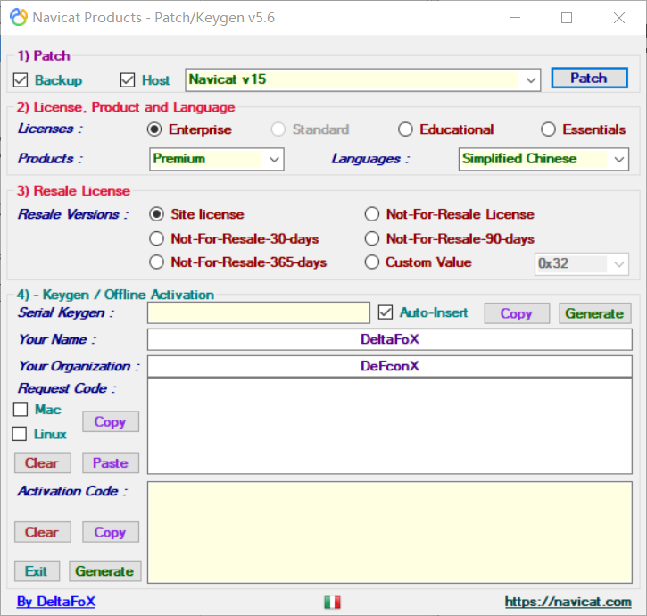
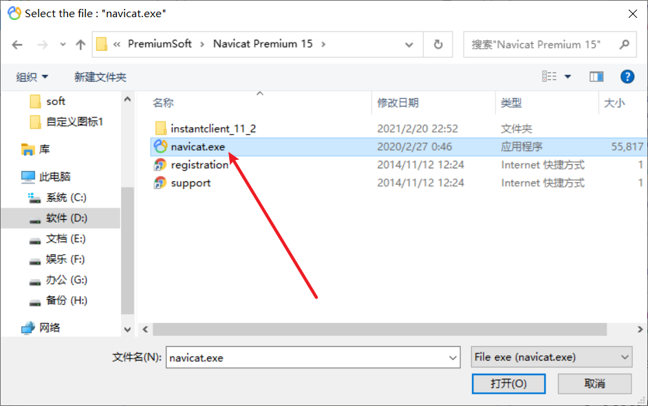
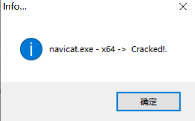
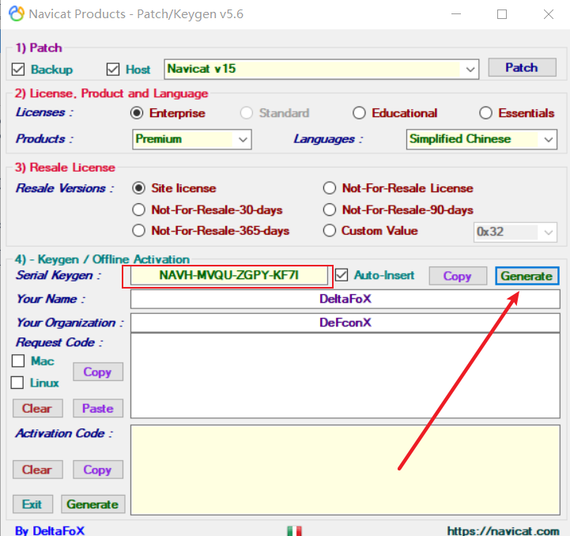
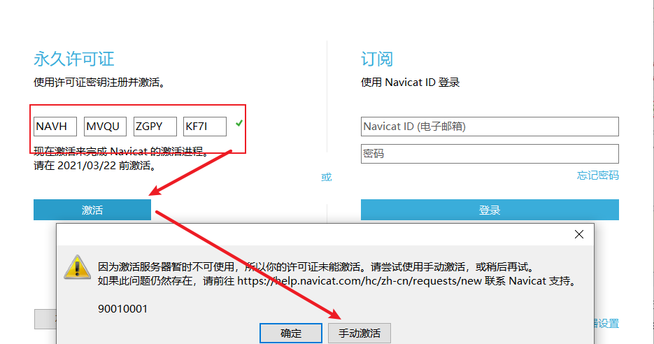
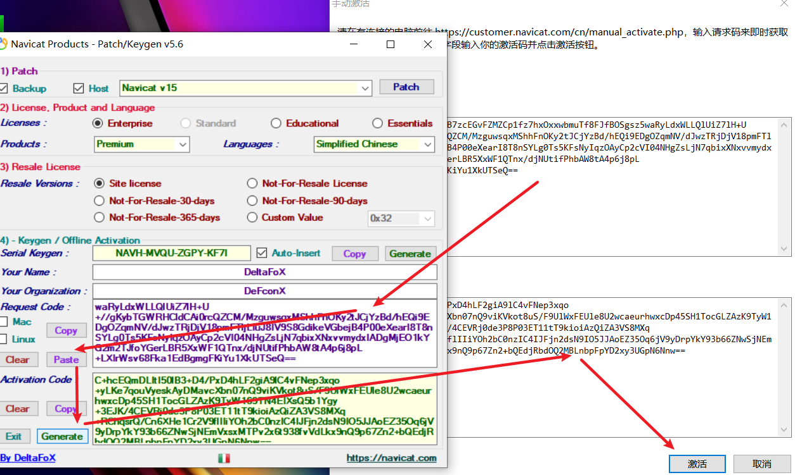

# windows管理软件

## 1.Navicat

Navicat15破解：

[下载地址](https://sevenyjl.lanzous.com/iRQgJlx77ad)

1. 打开压缩包
2. 安装navicat150_premium_cs_x64.exe
3. 打开Navicat_Keygen_Patch_v5.6_By_DFoX.exe【关闭防火墙，断网更好】
4. 点击右上角Patch
5. 选择Navicat15安装的路径
6. 点击Generate
7. 打开Navicat15并使用生成的激活码
8. 复制好请求码，并粘贴到修改器中，然后点击Generate生成破解码
9. 激活完成

## 2.DBever